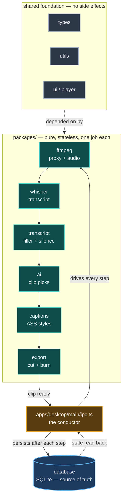

# Clipper

Open-source alternative to OpusClip, Descript & Submagic. Turn long recordings into viral shorts for TikTok, Reels & YouTube Shorts — runs fully local, bring your own API key, no subscription, no watermark.

**Mac only for now.** Windows support planned.

## What it does

- Transcribes video locally via Whisper (no data leaves your machine)
- AI detects the best clips with scores and reasons
- Review, trim, and approve clips in a visual editor
- Export clips as 9:16 vertical video with burned-in subtitles
- Export full episode with filler words and silences removed

## Prerequisites

- macOS
- [Homebrew](https://brew.sh)
- [Groq API key](https://console.groq.com) (free — used for AI clip suggestions)

## Setup

```bash
git clone https://github.com/PriyeshPandey2000/ai-video-clipper.git
cd ai-video-clipper
bash scripts/setup.sh
```

The script installs Node.js, pnpm, dependencies, and the bundled FFmpeg. It also creates a `.env` template.

Add your Groq key to `.env`:

```
GROQ_API_KEY=your_key_here
```

## Run

```bash
pnpm dev
```

## How it works

Think of Clipper as an **assembly line**, not a video editor. A long recording goes in one end, ready-to-post shorts come out the other. You just review the parts the AI picks.


1. Drop a video file into the app
2. Pick a Whisper model and click Transcribe
3. AI suggests the best clips with scores and reasons — review and approve
4. Toggle 9:16 reframe if needed, drag to set crop position
5. Click Export Clips or Export Episode

## Architecture

The packages are pure, stateless "stations" — no package but `database` ever touches SQLite. One conductor, [`apps/desktop/src/main/ipc.ts`](apps/desktop/src/main/ipc.ts), drives every station in order and persists the result after each one. The UI lives in [`apps/desktop/src/renderer`](apps/desktop/src/renderer) and only ever talks to the conductor over IPC.



- Want to improve clip picking? Start at `packages/ai`
- Fix a transcription quirk? Start at `packages/whisper` or `packages/transcript`
- Change the export pipeline? Start at `packages/ffmpeg`, `packages/captions`, or `packages/export`

The deep dive — IPC contracts, database schema, dependency rules — is in [`docs/ARCHITECTURE.md`](docs/ARCHITECTURE.md).

## Tech stack

Electron · React 19 · TypeScript · Tailwind v4 · SQLite (Drizzle ORM) · whisper.cpp · FFmpeg · Groq (Llama 3.3 70B)

## Contributing

Issues and PRs welcome. Check [open issues](https://github.com/PriyeshPandey2000/ai-video-clipper/issues) for what's being worked on.

```bash
bash scripts/setup.sh  # first-time setup
pnpm dev               # start app
pnpm turbo typecheck   # type check all packages
pnpm turbo lint        # lint all packages
```

## License

MIT
