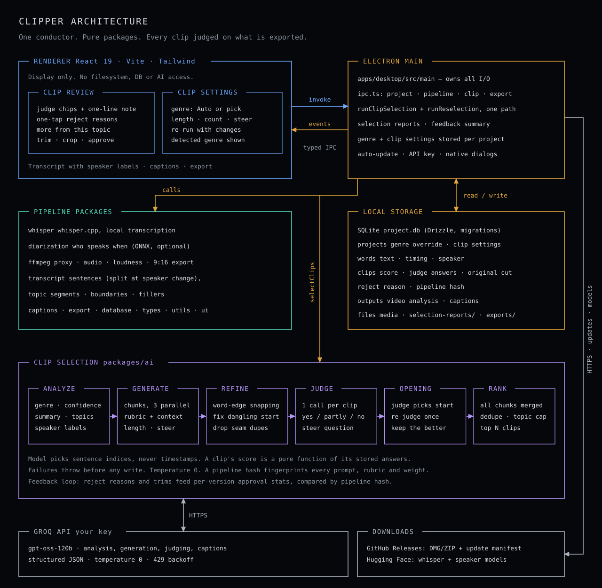

# Architecture



The diagram shows the architecture once the clip-selection roadmap (#100–#105 and #108) has landed; `ROADMAP.md` lists what is built today. The sections below describe the pieces in detail.

## Core principle

Pipeline-first. Not a video editor. Long recording → AI → publishable content.
Users don't want to edit. They want content published. The editor is a thin review layer.

## Tech stack

| Layer            | Choice                                | Why                                                        |
| ---------------- | ------------------------------------- | ---------------------------------------------------------- |
| Desktop runtime  | Electron 32                           | Cross-platform, full Node.js access for FFmpeg/Whisper     |
| UI               | React 19 + Vite 5                     | Fast DX, component model, HMR                              |
| Styling          | Tailwind CSS 4                        | Utility-first, no runtime CSS                              |
| Language         | TypeScript 5 strict                   | Catch errors early, great IDE support                      |
| Monorepo         | Turborepo + pnpm workspaces           | Parallel builds, shared packages, caching                  |
| Database         | SQLite (Drizzle ORM + better-sqlite3) | Local, fast, relational, atomic writes                     |
| Video processing | FFmpeg (bundled)                      | Industry standard, reliable, no dependency on user install |
| Transcription    | Whisper.cpp (downloaded on first run) | Local, private, no API cost, word-level timestamps         |
| AI (content)     | Groq today (user's API key)           | Cloud, free tier, fast; provider-agnostic `AiClient`       |

## Process architecture

```
┌─────────────────────────────────────┐
│           Renderer Process          │
│   React UI — display only           │
│   Video playback (HTML5 <video>)    │
│   No direct file/DB/AI access       │
└──────────────┬──────────────────────┘
               │ IPC (contextBridge)
┌──────────────┴──────────────────────┐
│           Main Process              │
│   SQLite database                   │
│   FFmpeg subprocess                 │
│   Whisper subprocess                │
│   AI API calls (Groq)               │
│   File system access                │
└─────────────────────────────────────┘
```

**Rule:** Renderer never touches filesystem, DB, or AI APIs directly.
All data flows through typed IPC channels defined in `@video-editor/types`.

## Monorepo layout

```
video-ai-editor/
├── apps/
│   └── desktop/               ← Electron app (main + preload + renderer)
│
├── packages/
│   ├── types/                 ← Shared TS types + IPC channel map
│   ├── utils/                 ← Pure utility functions (no side effects)
│   ├── database/              ← Drizzle schema, migrations, DB init
│   ├── ai/                    ← AI client + clip selection (analysis, profiles, judge)
│   ├── ffmpeg/                ← FFmpeg wrapper (clip export, proxy gen, audio extract)
│   ├── whisper/               ← Whisper model download + transcription runner
│   ├── transcript/            ← Transcript processing (filler detection, silence, SRT)
│   ├── captions/               ← Caption styling (ASS subtitle generation for burn-in)
│   ├── export/                ← Export pipeline orchestration
│   ├── player/                ← React <VideoPlayer> component
│   └── ui/                    ← Shared UI components (Button, Card, Badge, etc.)
│
├── docs/
│   ├── ARCHITECTURE.md        ← this file
│   ├── DECISIONS.md           ← ADRs
│   └── ROADMAP.md             ← phased feature plan
```

## Data pipeline

```
1. User drops video
        ↓
2. Main process: copy to project folder, create project.db
        ↓
3. FFmpeg: generate proxy (low-res for fast playback) + extract audio (WAV 16kHz)
        ↓
4. Whisper: transcribe audio → word-level timestamps → write to DB (words table)
        ↓
5. transcript package: detect filler words + silences → write to DB (segments table)
        ↓
6. AI (cloud): understand the video, pick clips, judge each one → see "Clip selection pipeline" below
        ↓
7. Write results to DB (clips, ai_outputs) and a selection report to disk
        ↓
8. Notify renderer via IPC: "pipeline:complete"
        ↓
9. Renderer: display clip cards, transcript, AI outputs
        ↓
10. User: approve/reject clips, edit blog post, copy captions
        ↓
11. Export: FFmpeg cuts approved clips → burns captions → writes to exports/
```

## Clip selection pipeline

Lives in `packages/ai` (`clip-selector.ts` orchestrates; `video-analysis.ts`, `profiles.ts`,
`clip-judge.ts`, `concurrency.ts` hold the parts). `packages/ai` does no I/O: `selectClips` returns
clips plus a full trace, and `apps/desktop/src/main/ipc.ts` (`runClipSelection`) stores them.

```
words → sentences → topic segments                                  (packages/transcript)
  │
  ├─ analyzeVideo        one structured call: profile + confidence, summary, speakers, topics
  │                      (long transcripts are excerpted, with every gap marked); falls back to
  │                      solo_opinion/low on failure and never aborts the run
  ├─ effective profile = user override ?? detected profile          (profiles.ts: 6 profiles)
  │
  ├─ chunk               ≤30 min: one call; else ~20 min chunks, 150 s overlap, 3 in flight
  ├─ generate (recall)   VIDEO CONTEXT + profile rubric; model returns sentence index ranges
  ├─ refine              deterministic: word edges, dangling-opener repair, 15–90 s clamp
  ├─ mechanical gate     too short / does not end on a complete thought
  ├─ drop seam duplicates   ≥ 90 % overlap, before spending a judge call on them
  ├─ judge               one call per clip on its exact exported text, 3 in flight
  │                      graded yes / partly / no per question; clear "no" on standalone or
  │                      payoff rejects the clip
  └─ rank                all chunks together by judge score → overlap dedupe (keep higher score)
                         → top maxClips (10)
```

**Rules the code relies on**

- The model picks sentence indices, never milliseconds. Every timestamp comes from our word table.
- The judge scores what will be exported, not the range the model proposed. The score is a pure
  function of the answers and the question weights, so old runs can be re-scored offline.
- Nothing in the selection path is random; the client pins temperature to 0.
- Failure never silently becomes "no clips": all chunks failing, or more than half of the judge
  calls failing, throws **before** any DB write, so a re-run keeps the previous suggestions. One
  failed judge call rejects only that candidate.
- 429s on generation and judge calls back off, honouring `retry-after`.
- `PIPELINE_VERSION` (hand-bumped, currently `v3-judge-global-rank`) names the code;
  `pipelineHash` fingerprints every prompt, rubric, question, weight and threshold the path reads.

**What a run stores**

| Where                              | What                                                                                                                                                                                 |
| ---------------------------------- | ------------------------------------------------------------------------------------------------------------------------------------------------------------------------------------ |
| `clips`                            | `ai_score` (judge score), `judge_json` (answers, questions, note), `ai_rank`, `original_start_ms/end_ms`, `pipeline_version/hash`, `ai_model`, `content_type` (profile id), `source` |
| `projects.clip_profile_override`   | The user's profile choice; NULL = use the detected one                                                                                                                               |
| `ai_outputs` type `video_analysis` | The analysis JSON, replaced on every run                                                                                                                                             |
| `<project>/selection-reports/`     | Every candidate and its fate, judge answers and notes, rejected ones included                                                                                                        |

**Re-running.** `clip:reselect` and `project:set-clip-profile` share one path (`runReselection`). It
re-runs selection from the stored words, replaces only `suggested` clips (approved, rejected and
exported ones are kept), and restores the previous override if the run fails.

The genre control (detected profile, confidence, override dropdown, `visual` warning) is in
`ClipReview`; its wording comes from `describeClipProfile` in `@video-editor/types`.

**Not built yet:** the UI does not show the judge's ranking order (the list is sorted by time), and the progress message does
not name the judging phase.

## Project storage

```
~/Library/Application Support/VideoAIEditor/projects/
  {project-id}/
    project.db          ← SQLite (metadata, words, clips, segments, ai_outputs)
    original.mp4        ← original file (never modified)
    proxy.mp4           ← low-res for fast playback
    audio.wav           ← extracted audio for Whisper
    selection-reports/  ← one .json + .md per clip-selection run (what was proposed, judged, dropped)
    exports/
      clip_01_abc12345.mp4
      blog_post.md
```

Media is always referenced by path, never embedded in SQLite.

## IPC channel contract

All channels typed in `packages/types/src/index.ts` → `IpcChannels`.
Clip-selection channels: `clip:reselect`, `clip:last-report`, `project:get-clip-profile`,
`project:set-clip-profile`.
Preload exposes `window.api.invoke(channel, args)` and `window.api.on(channel, callback)`.
Never use `ipcRenderer.send` / `ipcRenderer.sendSync` directly.

## Package dependency rules

```
ui        → (no internal deps)
types     → (no internal deps)
utils     → (no internal deps)
database  → types, utils
whisper   → types
ffmpeg    → types
transcript → types, utils, whisper (types only)
ai        → types, transcript
captions  → utils, types (types only)
export    → types, utils, ffmpeg
player    → types
desktop   → all packages
```

No circular deps. `types` and `utils` are pure leaf packages.

## FFmpeg binary

Bundled at `resources/ffmpeg/ffmpeg` (mac/linux) or `resources/ffmpeg/ffmpeg.exe` (win).
In dev: resolved relative to workspace root.
In prod: resolved from `process.resourcesPath`.
Download prebuilt binaries from ffmpeg.org static builds for each platform.

## Whisper binary + models

Binary: `resources/whisper/whisper-cli` (bundled, same pattern as FFmpeg).
Models: downloaded to `app.getPath("userData")/models/whisper/ggml-{size}.bin` on first use.
Default model: `base` (~145MB). User can switch to `small` for better accuracy.

## AI abstraction

`@video-editor/ai` exposes `createAiClient(provider, apiKey)` → `AiClient`.
Free text goes through `AiClient.complete`; structured output (clip selection, analysis, judging)
goes through `AiClient.generateObject`, which retries malformed JSON and pins temperature.
Swap provider by changing the `provider` arg — no other code changes needed.
API key stored in system keychain (implementation: later).

## Coding standards (enforced)

- Strict TypeScript — no `any`, no `as unknown as X` without comment
- No barrel re-exports from `apps/desktop` — import from packages directly
- React components: render + interaction only. Business logic in services/packages.
- No direct DB calls from renderer — IPC only
- Path aliases: `@/` maps to `src/renderer/src/` in renderer
- Pre-commit hook runs `lint-staged` (ESLint + Prettier)
